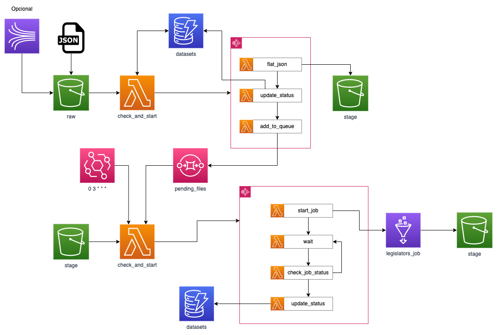

# Data Engineering / Curso
## Clase 1
Para poder correr ejecutar correctamente el script ubicado en el path
`clase-1/kinesis-example.py` se deben seguir estos pasos:
1. Desde la consola de AWS, en el servicio de Kinesis, crear un data stream.
2. Configurar un acceso programático con AWS CLI, reemplazando por el nombre del perfil elegido:
   ```shell
    aws configure --profile <mi_perfil>
    ```
3. Crear un virtual envivoremente de Python e instalar los paquetes listados en el archivo `requirements.txt`
4. Activar el venv y ejecutar el archivo python de la siguiente manera:
   ```shell
    python kinesis_example <num_records> -s <data_stream_name>
    ```
   Reemplazando los placeholders `<num_records>` y `<data_stream_name>`
5. Observar los resultados en la consola de AWS.

## Clase 2
Para esta clase es necesario crear anteriormente un bucket de S3 en la cuenta de AWS con un nombre elegido.
Dicho nombre se debe reemplazar en el archivo `clase-2/TBL_MEDICAL_RESEARCH.sql` en el placeholder `<BUCKET>`.

Una vez creado y habiendo hecho el reemplazo, seguir estos pasos:
1. Entrar a la consola de AWS, al servicio de Athena.
2. Configurar el path para guardar los resultados de Athena, puede ser en el mismo bucket creado.
3. Ejecutar el contenido archivo `clase-2/DB_DATAPATH_DEMO.sql`.
4. Ejecutar el contenido archivo `clase-2/TBL_MEDICAL_RESEARCH.sql`.
5. Por último agregar los archivos ubicados en el .zip `data.zip`, llamados `medicalresearch_part1.csv` y `medicalresearch_part2.csv` en el path `/raw/medicalresearch/` del bucket de S3 creado.

## Clase 3
En esta clase se hace un recorrido por lo ya visto en clase y se introduce el concepto
de procesamiento de datos en la nube, para este ejercicio será necesario realizar los siguientes pasos:
1. Reemplazar el placeholder `<BUCKET>` con el nombre del bucket creado para la clase anterior, dentro los archivos de laS carpetas `clase-3/glue_ddl` y `clase-3/glue_jobs`.
2. Reemplazar el placeholder `<YOUR_ACCOUNT_ID>` con el número de cuenta creada para la demo.
3. Guardar los archivos `clase-3/emr_scripts/CURATE_TABLE_DEMO.hql` y `clase-3/glue_jobs/word_counter_job.py` en una key llamada `/artifactory` dentro del bucket creado.
4. Disparar el job de EMR tal como se vió en clase.
5. Desplegar la máquina de estado que se encuentra en el archivo `clase-3/stg_to_analytics_sf.asl.json` junto a sus lambdas ubicadas en la carpeta `clase-3/lambda`.

## Clase complementaria
La arquitectura que se crea para esta clase es la siguiente:


Ya que es una actividad compleja que se va armando desde los inicios de esta clase y va integrando los conceptos vistos,
se recomienda seguir los pasos de las anteriores clases y revisitar la grabación de la misma.